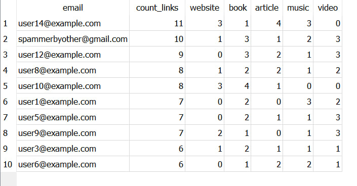

#  LinkCat 🐈 
___
# Installation ⚙️
##### ⚠️ on Linux: start commands with `sudo`

1. `git clone https://github.com/WittyB0y/CatLink.git` - Clone the project from GitHub.
2. `cd CatLink` - Go to the directory with docker-compose.yml.
3. `docker-compose build` - Build image for Docker.
4. `docker-compose up` - Up containers.
5. `docker-compose run --rm web-app sh -c "python manage.py makemigrations"` - Prepare for migrations.
6. `docker-compose run --rm web-app sh -c "python manage.py migrate"` - Do migrate.
7. `docker-compose run --rm web-app sh -c "python manage.py fill_db_user"` - Fill up DB with test user data.
8. `docker-compose run --rm web-app sh -c "python manage.py fill_db_collection"` - Fill up DB with test links and collections data.
   
#### ⚠️ if after fill up db with test data project is not up, reload containers!
### You launched the project! 🐱‍

---
# Links 

#### Project (CatLink) 🐈🧷: http://localhost:8000/
#### Swagger 📖: http://localhost:8000/swagger/
#### Flower 🌼: http://localhost:5555/
#### Admin-panel : http://localhost:8000/admin/ 

---
# Login details for test user (admin) 🆔
#### Login: `spammerbyother@gmail.com`
#### Password: `userTest123`

###### for all test users are the same password.

###### login: user{number}@example.com
###### Password: `userTest123`

---
# Conclusion ✏️
## ✅ All tasks were completed! ✅
## Task 1:
In addition to the basic demands, the following were made:
1. connect Celery to the project for background tasks (parse sites, email-notifications).
2. connect Flower for monitoring background tasks.
3. setting post-server for email notification.
4. connect Postgres to the project.
5. connect Redis like message broker between Django and Celery.
6. wrote funcs for filling up DB with the test data.
7. project deployment is configured.
8. flake8 for codestyle.
9. pre-commit for autorun codestyle pipeline.
## Task 2: 
SQL-query: [task2.sql](https://github.com/WittyB0y/CatLink/blob/master/task2.sql)

Example the result query (test funcs fill up with random test data):

# ⚠️ I didn't delete .env file from project! ⚠️
